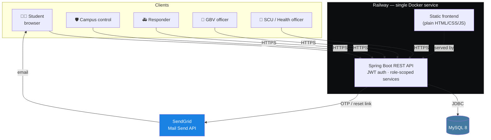
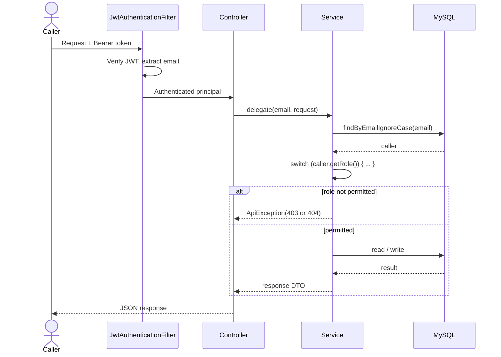
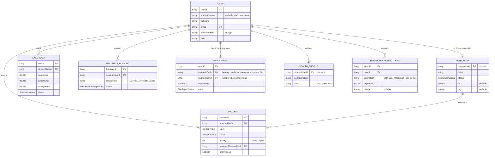
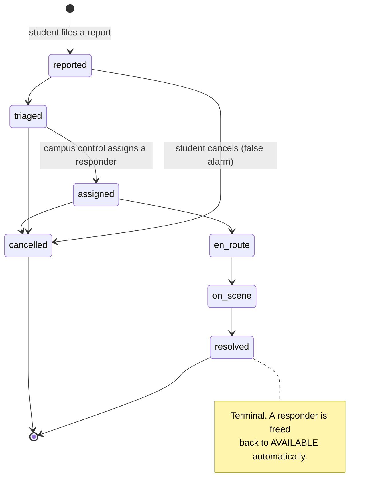

<div align="center">

# UFH Safety Platform

**A campus emergency, incident and wellness platform for the University of Fort Hare.**

Report an incident, trigger an SOS, reach campus control, or get confidential GBV support and wellness care — one platform, five roles, one shared source of truth.

[](https://ufh-safety-platform-production.up.railway.app)
[](#this-is-a-prototype)

[](backend/pom.xml)
[](backend/pom.xml)
[](database)
[](frontend/js/map.js)
[](frontend/js/api.js)
<br/>
[](backend/README-BACKEND.md#tests)
[](https://github.com/Mjubane5/ufh-safety-platform/pulls?q=is%3Apr+is%3Amerged)
[](docs/team-working%20agreement_1.md)
[](docs/hosting-railway.md)

[Live demo](https://ufh-safety-platform-production.up.railway.app) · [API contract](docs/api-contract.md) · [Backend setup](backend/README-BACKEND.md) · [Status report](docs/PROJECT-STATUS-REPORT.md) · [Software documentation (PDF)](docs/SOFTWARE-DOCUMENTATION.pdf)

</div>

---

## This is a prototype

**Not connected to any real emergency service, campus authority, or GBV support unit.** Every account, incident and report in this system is synthetic. It exists to demonstrate what a real platform like this could do — nothing typed into it reaches anyone. If you need real help right now: **112** (any mobile, no airtime needed), **10111** (SAPS), or the **GBV Command Centre** on **0800 428 428**.

This is a CSC 200/CSC 300 capstone project at the University of Fort Hare, Department of Computational Sciences.

---

## Contents

[What it does](#what-it-does) · [Architecture](#architecture) · [Data model](#data-model) · [Incident lifecycle](#incident-lifecycle) · [Engineering practices](#engineering-practices) · [Tech stack](#tech-stack) · [Getting started](#getting-started) · [Testing](#testing) · [Project structure](#project-structure) · [Documentation](#documentation) · [Team](#team)

---

## What it does

Four kinds of people share one system, each seeing only what their role allows:

| Role | Can do |
|---|---|
| **Student** | One-tap SOS, incident reports (9 types, works with or without location), live safety map with patrols/hotspots/safer routes, Safe Walk (share live location on a route until you arrive), wellness bookings + chat with the Student Counselling Unit and Campus Health Centre separately, confidential GBV reporting (anonymous or not) with reference-code status lookup, a declarable health profile for responders, and a general contact channel to campus control |
| **Campus control** | Live dispatch queue sorted by priority, responder assignment, patrol logging, active Safe Walk monitoring, the general student contact queue |
| **Responder** | Assigned-incident view, status lifecycle (`en_route` → `on_scene` → `resolved`) |
| **GBV support officer** | Confidential case queue, status management, and a chat scoped to a report's reference code — never to a student account, so a reporter's identity is never visible even to the officer handling it |
| **SCU / Health Centre officer** | Separate booking queues and message threads for counselling vs. physical health, kept apart so a physical-health question never lands in a counsellor's inbox |

Every incident moves through one real lifecycle instead of being treated as a one-way message into a void — see [Incident lifecycle](#incident-lifecycle) below.

---

## Architecture

One Spring Boot service serves the REST API *and* the built frontend from the same origin — no CORS to configure in production, one push updates both halves.



### Request lifecycle

Every protected request follows the same path — a `switch` on the caller's role inside the service layer, not a framework annotation, so every 403 and every 404 is a line of code someone on the team wrote and can explain:



---

## Data model

Core entities and how they relate. Every foreign key here is a plain `Long`/`String` column resolved manually in the service layer — no JPA `@ManyToOne` relationships anywhere in the codebase, a deliberate, consistent choice so that visibility rules (who may read which row) live in one auditable place instead of being implied by an object graph.



*(Four more entities follow the same pattern and are omitted here for readability: `WellnessMessage`, `HealthMessage`, `CampusControlMessage` — one row per message, `studentUserId` + `sender` + `text` — and `GbvMessage`, keyed by `referenceCode` instead of a user, never a name.)*

---

## Incident lifecycle

A fixed state machine, enforced server-side — `StatusTransitions.isLegal(current, target)` rejects any jump that skips a step, and a terminal state (`resolved`/`cancelled`) can never move again. Nothing is ever hard-deleted; a false alarm is `cancelled`, not erased, so there's always a record to review.



---

## Engineering practices

Concrete choices, not abstract claims — each one is a specific file or test you can open.

| Practice | Where it shows up |
|---|---|
| **Contract-first API design** | [`docs/api-contract.md`](docs/api-contract.md) is the single source of truth, agreed *before* implementation for every endpoint added this project — if code and contract disagree, the contract wins |
| **Layered architecture** | `Controller → Service → Repository` throughout; controllers never touch a repository directly, services never see an `HttpServletRequest` (except the one documented case building a reset-link host, `AuthController.frontendBaseUrl`) |
| **Information-leak-aware error design** | A caller who can't view a resource at all gets `404`, not `403` — `403` would itself confirm the resource exists (see `IncidentService.requireCanView`, `GbvReportService.requireReport`) |
| **Anonymity enforced structurally, not by convention** | `GbvReportItem` and `GbvChatQueueResponse.Item` have *no field* for reporter identity — not a null one, structurally absent — so a future change can't leak it by accident. Verified directly with a reflection test on the record's components (`GbvReportServiceTest.theQueueNeverIncludesReporterIdentity`) |
| **Right hash for the threat model** | Login codes and passwords use BCrypt (slow, on purpose — resists brute-forcing a *low-entropy* secret). Password-reset tokens use SHA-256 instead (`PasswordResetToken`'s class comment explains why: 256 bits of `SecureRandom` doesn't need a slow hash, and needs to be a direct, fast, queryable lookup key) |
| **No-enumeration guarantees, tested** | Forgot-password returns the identical response for a registered and an unregistered email — asserted directly in `PasswordResetServiceTest.theResponseIsIdenticalForKnownAndUnknownEmails`, not just documented |
| **Rate limiting where it matters most** | The public GBV status-lookup endpoint is rate-limited per caller IP (`GbvStatusLookupRateLimiter`) — brute-forcing a reference code by trying many at speed is the realistic attack, so limiting is scoped to the caller, not the code |
| **Test strategy matched to the risk** | 186 pure unit tests (JUnit 5 + Mockito + AssertJ, no database) targeting the actual security boundaries — every role/endpoint combination, every 403-vs-404 decision, every idempotency case (cancelling an already-cancelled incident is a no-op, not an error) |
| **Mobile-first, verified in-browser** | Every page built for a ~375px viewport first; UI fixes this project shipped (header wrapping, an invisible-at-desktop-width sign-out button) were caught by testing at real breakpoints in a browser, not assumed from the CSS |
| **Honest documentation of real limitations** | Known gaps are written down where the next person will find them, not hidden — see `docs/api-contract.md`'s note on missing rate limiting for login codes, and `backend/README-BACKEND.md`'s documented SendGrid deliverability limitation, including the exact SMTP error code encountered and why |

---

## Tech stack

| Layer | Technology | Why |
|---|---|---|
| Frontend | Plain HTML, CSS, JavaScript — no framework | Every network call goes through one file (`api.js`), so the whole app works against a mock before the backend exists, and against the real thing after with zero page changes |
| Backend | Java 17, Spring Boot 3 | REST, JSON and JDBC handled for us; one deployable jar in production |
| Database | MySQL 8 | Managed instance on Railway in production, a portable local instance for development |
| Maps | Leaflet + OpenStreetMap | No API key, no quota, no billing |
| Auth | JWT bearer tokens, BCrypt password hashing | Two-step email verification for students; a fixed 8-hour token, no refresh — simple and adequate for a prototype |
| Real-time-ish | 5-second polling everywhere it's needed | No socket reconnection logic to debug, and one consistent pattern across dispatch, chat, and Safe Walk tracking |
| Email | SendGrid Mail Send API, plain HTTP | No SDK dependency — one JSON POST covers both the login code and the password-reset link |
| Hosting | Railway, single Docker service | The backend serves the built frontend from the same origin |

---

## Getting started

```bash
git clone https://github.com/Mjubane5/ufh-safety-platform.git
cd ufh-safety-platform
```

**Backend** — full setup (MySQL, `JWT_SECRET`, optional SendGrid email) in **[backend/README-BACKEND.md](backend/README-BACKEND.md)**:

```powershell
cd backend
.\mvnw spring-boot:run
```

**Frontend** — served separately in local development, bundled into the backend's own jar in production:

```powershell
python -m http.server 5500
```

Then open `http://localhost:5500/frontend/register.html`. The frontend runs entirely on mock data by default (`frontend/js/config.js`) — no backend required to explore the UI. Flip `MOCK = false` in that file to point it at a running local backend.

---

## Testing

```powershell
cd backend
.\mvnw test
```

186 tests, pure JUnit 5 + Mockito + AssertJ, no database required. Every role boundary on every endpoint is asserted directly — not just "does it return 200," but "does the wrong role get exactly the 403 or 404 the contract specifies, and does an officer-facing response structurally exclude the fields it must never expose." See [Engineering practices](#engineering-practices) above for specific examples.

---

## Project structure

```
ufh-safety-platform/
├── backend/                 Spring Boot API
│   └── src/main/java/za/ac/ufh/safety/
│       ├── auth/             registration, login, two-step email verification
│       ├── incidents/        report → dispatch → resolve lifecycle, live signals
│       ├── responders/       duty status, assignment
│       ├── safetywalk/       patrols, hotspots, safer routing, live Safe Walk sessions
│       ├── wellness/         SCU bookings, messaging, officer queue
│       ├── health/           Campus Health Centre messaging (bookings shared with wellness/)
│       ├── healthprofile/    student-declared conditions for responders
│       ├── campuscontrol/    general student ↔ campus control contact channel
│       ├── gbv/              confidential reporting, status, anonymity-preserving chat
│       ├── passwordreset/    forgot/reset password
│       └── user/, common/, config/   shared entity, error shape, security config
├── frontend/                 Plain HTML/CSS/JS, one page per screen
│   ├── js/api.js             the only file allowed to call fetch()
│   └── assets/                the official UFH crest
├── docs/
│   ├── api-contract.md       single source of truth for every endpoint
│   ├── PROJECT-STATUS-REPORT.md
│   └── team-working agreement_1.md
└── database/                  schema and seed SQL
```

---

## Documentation

| Document | What's in it |
|---|---|
| [`docs/SOFTWARE-DOCUMENTATION.pdf`](docs/SOFTWARE-DOCUMENTATION.pdf) | The full technical write-up: architecture, data design (ER diagram), request/security lifecycle, module-by-module design, testing strategy, and the engineering practices behind it |
| [`docs/api-contract.md`](docs/api-contract.md) | Every endpoint: request/response shapes, roles, error cases. If code and this disagree, this document is right |
| [`backend/README-BACKEND.md`](backend/README-BACKEND.md) | Local backend setup, the JWT signing key, SendGrid email (including a documented deliverability limitation) |
| [`docs/PROJECT-STATUS-REPORT.md`](docs/PROJECT-STATUS-REPORT.md) | Problem statement, scope changes, architecture, contribution matrix, AI-assistance disclosure |
| [`docs/team-working agreement_1.md`](docs/team-working%20agreement_1.md) | Pairing, workload split, decision log, definition of done |

---

## Team

A team of eight, University of Fort Hare, working in backend/frontend pairs — see [`docs/team-working agreement_1.md`](docs/team-working%20agreement_1.md) for the full pairing and ownership breakdown, and [`docs/PROJECT-STATUS-REPORT.md`](docs/PROJECT-STATUS-REPORT.md) for the individual contribution matrix.

---

<div align="center">

Coursework for the Department of Computational Sciences, University of Fort Hare.
All data in this repository is synthetic. This is not a live safety service.

</div>
