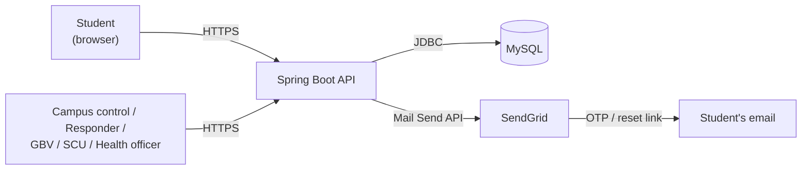

<div align="center">

# UFH Safety Platform

**A campus emergency, incident and wellness platform for the University of Fort Hare.**

Report an incident, trigger an SOS, reach campus control, or get confidential GBV support and wellness care — one platform, five roles, one shared source of truth.

[](https://ufh-safety-platform-production.up.railway.app)
[](backend/README-BACKEND.md#tests)
[](#tech-stack)
[](#this-is-a-prototype)

[Live demo](https://ufh-safety-platform-production.up.railway.app) · [API contract](docs/api-contract.md) · [Backend setup](backend/README-BACKEND.md) · [Status report](docs/PROJECT-STATUS-REPORT.md)

</div>

---

## This is a prototype

**Not connected to any real emergency service, campus authority, or GBV support unit.** Every account, incident and report in this system is synthetic. It exists to demonstrate what a real platform like this could do — nothing typed into it reaches anyone. If you need real help right now: **112** (any mobile, no airtime needed), **10111** (SAPS), or the **GBV Command Centre** on **0800 428 428**.

This is a CSC 200/CSC 300 capstone project at the University of Fort Hare, Department of Computational Sciences.

---

## What it does

Four kinds of people share one system, each seeing only what their role allows:

| Role | Can do |
|---|---|
| **Student** | One-tap SOS, incident reports (9 types, works with or without location), live safety map with patrols/hotspots/safer routes, Safe Walk (share live location on a route until you arrive), wellness bookings + chat with the Student Counselling Unit and Campus Health Centre separately, confidential GBV reporting (anonymous or not) with reference-code status lookup, a declarable health profile for responders, and a general contact channel to campus control |
| **Campus control** | Live dispatch queue sorted by priority, responder assignment, patrol logging, active Safe Walk monitoring, the general student contact queue |
| **Responder** | Assigned-incident view, status lifecycle (`en_route` → `on_scene` → `resolved`) |
| **GBV support officer** | Confidential case queue, status management, and a chat scoped to a report's reference code — never to a student account, so a reporter's identity is never visible even to the officer handling it |
| **SCU / Health Centre officer** | Separate booking queues and message threads for counselling vs. physical health, kept apart so a physical-health question never lands in a counsellor's inbox |

Every incident moves through one real lifecycle — `reported → triaged → assigned → en_route → on_scene → resolved`, with `cancelled` as the false-alarm path — never deleted, only ever marked cancelled.

---

## Tech stack

| Layer | Technology | Why |
|---|---|---|
| Frontend | Plain HTML, CSS, JavaScript — no framework | Every network call goes through one file (`api.js`), so the whole app works against a mock before the backend exists, and against the real thing after with zero page changes |
| Backend | Java 17, Spring Boot 3 | REST, JSON and JDBC handled for us; one deployable jar in production |
| Database | MySQL 8 | Managed instance on Railway in production, a portable local instance for development |
| Maps | Leaflet + OpenStreetMap | No API key, no quota, no billing |
| Auth | JWT bearer tokens, BCrypt password hashing | Two-step email verification for students; a fixed 8-hour token, no refresh — simple and adequate for a prototype |
| Real-time-ish | 5-second polling everywhere it's needed | No socket reconnection logic to debug, and one consistent pattern across dispatch, chat, and Safe Walk tracking |
| Hosting | Railway, single Docker service | The backend serves the built frontend from the same origin — no CORS to configure in production, one push updates both halves |

---

## Architecture



One Spring Boot service serves the API and the static frontend from the same origin. Every write goes through role-scoped service-layer checks — a manual `switch` on the caller's role, not a framework annotation — so a 403 or 404 is a deliberate, auditable decision, not a filter nobody wrote down. See `docs/api-contract.md` for the full endpoint-by-endpoint contract, including which roles may call what and why a given error is a 403 versus a 404.

---

## Getting started

```bash
git clone https://github.com/Mjubane5/ufh-safety-platform.git
cd ufh-safety-platform
```

**Backend** — full setup (MySQL, `JWT_SECRET`, optional SendGrid email) in **[backend/README-BACKEND.md](backend/README-BACKEND.md)**:

```powershell
cd backend
.\mvnw spring-boot:run
```

**Frontend** — served separately in local development, bundled into the backend's own jar in production:

```powershell
python -m http.server 5500
```

Then open `http://localhost:5500/frontend/register.html`. The frontend runs entirely on mock data by default (`frontend/js/config.js`) — no backend required to explore the UI. Flip `MOCK = false` in that file to point it at a running local backend.

---

## Testing

```powershell
cd backend
.\mvnw test
```

186 tests, pure JUnit 5 + Mockito + AssertJ, no database required. Every role boundary on every endpoint is asserted directly — not just "does it return 200," but "does the wrong role get exactly the 403 or 404 the contract specifies, and does an officer-facing response structurally exclude the fields it must never expose" (checked via reflection on the response records themselves in the more sensitive areas, like GBV reporter identity).

---

## Project structure

```
ufh-safety-platform/
├── backend/                 Spring Boot API
│   └── src/main/java/za/ac/ufh/safety/
│       ├── auth/             registration, login, two-step email verification
│       ├── incidents/        report → dispatch → resolve lifecycle, live signals
│       ├── responders/       duty status, assignment
│       ├── safetywalk/       patrols, hotspots, safer routing, live Safe Walk sessions
│       ├── wellness/         SCU bookings, messaging, officer queue
│       ├── health/           Campus Health Centre messaging (bookings shared with wellness/)
│       ├── healthprofile/    student-declared conditions for responders
│       ├── campuscontrol/    general student ↔ campus control contact channel
│       ├── gbv/              confidential reporting, status, anonymity-preserving chat
│       ├── passwordreset/    forgot/reset password
│       ├── user/, common/, config/   shared entity, error shape, security config
├── frontend/                 Plain HTML/CSS/JS, one page per screen
│   ├── js/api.js             the only file allowed to call fetch()
│   └── assets/                the official UFH crest
├── docs/
│   ├── api-contract.md       single source of truth for every endpoint
│   ├── PROJECT-STATUS-REPORT.md
│   └── team-working agreement_1.md
└── database/                  schema and seed SQL
```

---

## Documentation

| Document | What's in it |
|---|---|
| [`docs/api-contract.md`](docs/api-contract.md) | Every endpoint: request/response shapes, roles, error cases. If code and this disagree, this document is right |
| [`backend/README-BACKEND.md`](backend/README-BACKEND.md) | Local backend setup, the JWT signing key, SendGrid email (including a documented deliverability limitation) |
| [`docs/PROJECT-STATUS-REPORT.md`](docs/PROJECT-STATUS-REPORT.md) | Problem statement, scope changes, architecture, contribution matrix, AI-assistance disclosure |
| [`docs/team-working agreement_1.md`](docs/team-working%20agreement_1.md) | Pairing, workload split, decision log, definition of done |

---

## Team

A team of eight, University of Fort Hare, working in backend/frontend pairs — see [`docs/team-working agreement_1.md`](docs/team-working%20agreement_1.md) for the full pairing and ownership breakdown, and [`docs/PROJECT-STATUS-REPORT.md`](docs/PROJECT-STATUS-REPORT.md) for the individual contribution matrix.

---

<div align="center">

Coursework for the Department of Computational Sciences, University of Fort Hare.
All data in this repository is synthetic. This is not a live safety service.

</div>
