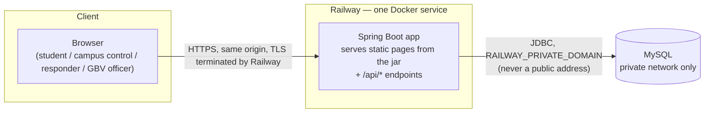
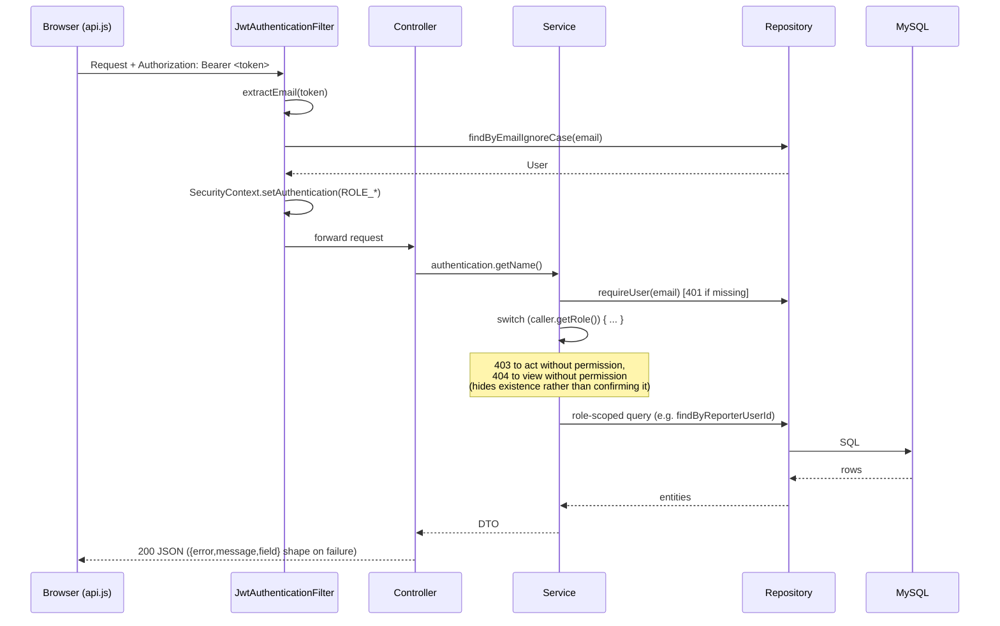
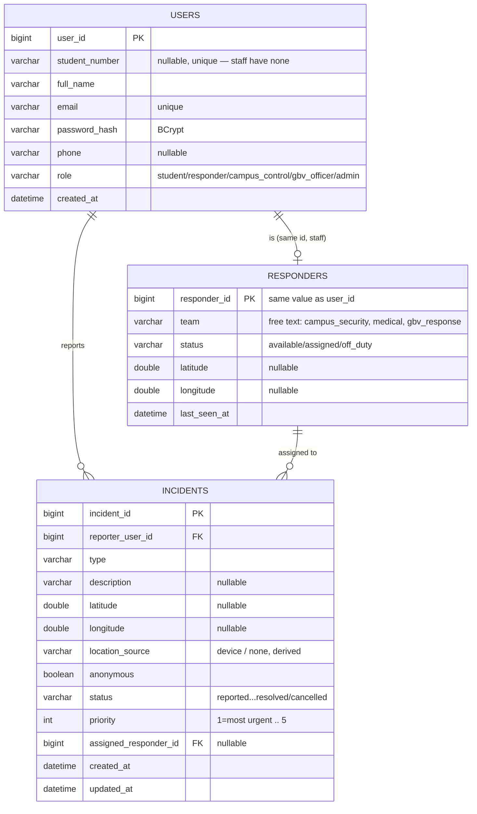

# UFH Safety Platform — Project Status Report

**Prepared:** 2026-09-12
**Repository:** [Mjubane5/ufh-safety-platform](https://github.com/Mjubane5/ufh-safety-platform)
**Live deployment:** https://ufh-safety-platform-production.up.railway.app

> **A date discrepancy to resolve as a team, not silently picked for you:**
> `CLAUDE.md` and `docs/team-working agreement_1.md` both still say final
> submission is **18 September 2026**, with presentations **21–23 September**.
> This report was requested on the basis that the submission date has moved
> to **23 September 2026**. This document uses 23 September, but that gap
> should be closed — either the working-agreement/CLAUDE.md need updating, or
> "23 September" is actually the last presentation day being used loosely as
> "the deadline." Recommend confirming with whoever moved the date.

---

## 1. Problem statement, audience, and objectives

**Problem.** University students face safety, emergency, and gender-based
violence (GBV) situations with no single, fast way to report an incident,
reach campus control, or find wellness support — existing channels are
fragmented across phone numbers, offices, and word of mouth.

**Target audience.** University of Fort Hare students (primary reporters),
campus control/dispatch staff, on-campus responders (security, medical), and
GBV officers, as four distinct roles with different access to the same
underlying incident data.

**Objectives**, as stated in `CLAUDE.md` and `docs/api-contract.md`:
- Let a student report an incident (including a one-tap SOS) in under a
  minute, with or without location access.
- Get that report to the right person — campus control for general
  incidents, a GBV officer for confidential cases — without exposing it to
  the wrong role.
- Track an incident through a real lifecycle (`reported → triaged → assigned
  → en_route → on_scene → resolved`, or `cancelled` for a false alarm) rather
  than a fire-and-forget submission.
- Do this as a **prototype**: synthetic data only, explicit and unmissable
  that no report reaches a real emergency service, safe to demonstrate
  publicly without the risk of someone in genuine distress relying on it.

This is a CSC 200/CSC 300 capstone at the University of Fort Hare — a team
of eight, four nominally on frontend and four on backend, graded in part on
being able to explain the system's own design decisions to a panel.

---

## 2. Scope changes, feature additions, and de-scoping

Compiled from `docs/team-working agreement_1.md`'s decision log, plus
decisions made in the two most recent work sessions (deployment and this
report's own scoping conversation).

| Date | Change | Why |
|---|---|---|
| pre-2026-09-10 | Real-time updates: **5-second polling**, not WebSockets | Team decision log — no new dependency, matches the "flag new libraries" rule in `CLAUDE.md` |
| pre-2026-09-10 | Map provider: **Leaflet + OpenStreetMap**, not Google Maps | No API key, no billing, per decision log |
| pre-2026-09-10 | Evidence storage: **filepath in MySQL**, not BLOB | Decision log |
| 2026-09-10 | Frontend bundled into the backend jar — **one Docker service**, not three | `feature/host-single-service` (PR #19): same-origin means no CORS to configure in production, one push updates both halves |
| 2026-09-10 | Demonstration interstitial required before any public hosting | `feature/demo-notice` (PR #18) and `docs/deployment.md` §5.1 — a safety prototype that looks real is a real hazard if someone in distress finds it |
| 2026-09-11 | Hosting target: **Railway**, not Render | `docs/hosting-railway.md` — Render's free MySQL doesn't exist (Postgres only) and its free tier sleeps; Railway runs the Dockerfile directly with managed MySQL |
| 2026-09-11 | Deployment docs (`DEPLOYMENT.md`, `AGENT-DEPLOYMENT-INSTRUCTIONS.md`) rewritten | They still described the pre-2026-09-10 three-service architecture; PR #22 |
| 2026-09-12 (planned) | GBV module: **text-only reports + officer queue** for this pass; **evidence upload deferred** | Multipart upload + EXIF-stripping is separate, non-trivial security work; scoping it out keeps the rest of the GBV flow (which carries "a significant part of the Security mark" per the working agreement) achievable in the time left |
| 2026-09-12 (planned) | Incident chat scoped to **non-anonymous flows only** | GBV reports are anonymous-by-design (`referenceCode`, no account, `contactPreference` must be `none` when anonymous) — a generic chat feature would conflict with that unless the contract is changed first, which needs team agreement, not a silent workaround |

**Also worth recording as a scope-relevant fact, not a decision:** Railway's
new-account trial credit is $5, valid 30 days from when the project was
created (2026-09-11) — it does **not** run indefinitely for free. After the
trial, keeping the demo live costs $5/month on the Hobby plan. Someone on the
team needs to own that, or the plan should be to keep a recording as the
fallback demonstration once the trial lapses (see `docs/hosting-railway.md`).

---

## 3. System architecture

### 3.1 Client–server data flow



One origin, one deployable, no cross-origin request in production — the
pages and the API are served by the same jar (`Dockerfile` copies
`frontend/` into `src/main/resources/static` at build time).

### 3.2 Request lifecycle (how a role gets enforced)



There is no `@PreAuthorize` or centralized route-based role gate —
`SecurityConfig` only decides authenticated-vs-not. Every role decision is a
manual `switch` inside a service class, close to the query it protects. New
modules (GBV, chat) are expected to follow this same pattern rather than
introduce a second authorization mechanism.

### 3.3 Data model (as built, plus what's planned)



`GbvReport` (keyed by a non-guessable `referenceCode`, not `user_id`) and
`IncidentMessage` are specified in `docs/api-contract.md` §7 and planned in
this report's Part 2, but **do not exist yet** — omitted from the diagram
above rather than shown as if built.

---

## 4. Technology stack and pivot justification

| Layer | Choice | Why (with the trade-off, not just the pick) |
|---|---|---|
| Frontend | Plain HTML/CSS/JS, no framework | `CLAUDE.md` mandate — keeps every line explainable to a panel without a build step to reason about |
| Backend | Java 17, Spring Boot 3.4.5 | Team's existing Java coursework background; Spring Security + Spring Data JPA cover auth and persistence without hand-rolling either |
| Auth | JWT (`jjwt` 0.12.6), BCrypt | Stateless — no session store needed; 120-minute fixed expiry, no refresh token (accepted trade-off per decision log, revisit if the demo runs long) |
| Database | MySQL 8 | Matches what's taught, and Railway offers it as a managed service (Render's free tier is Postgres-only — see §2) |
| Maps | Leaflet + OpenStreetMap | No API key, no billing risk for a student project (decision log) |
| Hosting | Railway, one Docker service | Pivoted from an earlier three-service draft (§2) once the Dockerfile was changed to bundle frontend into the jar — fewer moving parts, no CORS, one thing to redeploy |
| Algorithms | C++ (standalone) | Explicitly out of the request path per the contract — a demonstration of the algorithm, not a dependency of it |
| Analysis | Python (offline) | Results seeded into MySQL, not called at request time |

---

## 5. Repository and branch status

- **Repository:** https://github.com/Mjubane5/ufh-safety-platform (private)
- **Default branch:** `main`
- **Live URL:** https://ufh-safety-platform-production.up.railway.app
  (Railway project `dazzling-insight`, auto-redeploys on every merge to `main`)
- **No release tags exist yet.** Recommend tagging a checkpoint (e.g.
  `v0.1-progress`) once this report and Part 2 land, so "what was submitted"
  has a fixed reference point rather than "whatever `main` happened to be."
- **26 pull requests merged to date** (see §13 for the per-author breakdown),
  zero open, zero closed-without-merging except one empty/abandoned PR (#12).
  No branch protection issue currently blocking work.

---

## 6. Feature inventory — done vs. pending

Cross-checked against every endpoint/page named in `docs/api-contract.md`.

| Area | Status | Detail |
|---|---|---|
| Auth (register/login/me) | **Done** | `auth` package + `login.html`/`register.html` |
| Incident report/list/detail/status/cancel | **Done** | `incidents` package; student/responder/campus_control/admin role-scoped per §3.2 |
| Incident assignment (auto-nearest or explicit) | **Done** | `IncidentAssignmentService`, merged PR #26 (2026-09-12) — a responder is also now correctly freed back to `available` on resolve/cancel |
| Responder availability list | **Done** | `GET /api/responders/available`, `responders` package |
| Student dashboard | **Done** | `dashboard.html` — filters, pagination, skeleton/empty/error states |
| Incident report form | **Done** | `report.html` — geolocation capture with graceful fallback |
| Incident detail page | **Scaffolded, not rendered** | `incident.html`/`incident.js` (PR #25) parse the query string and encode the display rules, but rendering is explicitly not written yet |
| Patrols (`POST/GET /api/patrols`) | **Not started** | No `patrols` package |
| Safety map / hotspots / safe routes | **Not started** | No `hotspots` or `routes` package; no map-rendering code anywhere in the frontend despite Leaflet being the agreed provider |
| Wellness resources/bookings | **Not started** | No `wellness` package |
| GBV reporting (all of §7) | **Not started** | No `gbv` package on the backend, no GBV page on the frontend — fully specified in the contract, zero implementation |
| Campus control dashboard | **Not started** | No role-aware redirect exists at all today — every login lands on `dashboard.html` regardless of role |
| Responder view | **Not started** | Same gap |
| GBV officer dashboard | **Not started** | Same gap |
| Incident chat | **Not started** | Not in the contract yet either — see §2 |

---

## 7. Screenshots, API payloads, and wireframes

Captured this session against a local instance running `frontend/`'s own
`MOCK` mode (`python -m http.server 5500`, no backend required — the app's
documented way of running without live data) and cross-checked against the
live Railway URL. **Binary image files are not embedded in this Markdown
pass** — described here in enough detail to stand in until real screenshots
are added to a `docs/screenshots/` folder (or the `.docx` version of this
report, if one is produced).

- **Login (`/login.html`):** on first load, an interstitial dialog blocks
  the page — "This is a demonstration, not a real safety service," lists
  SAPS 10111, ambulance/fire 10177, the GBV Command Centre 0800 428 428, and
  Childline 116, and requires an explicit "I understand this is a
  demonstration" click before it dismisses. A persistent red banner with the
  same message stays pinned above the form afterward. Confirms
  `docs/deployment.md` §5.1 is actually implemented, not just documented.
- **Dashboard (`/dashboard.html`, mock data):** "Your reports, A" heading,
  a "Report an incident" CTA, status filter chips (All/Reported/Triaged/
  Assigned/En route/On scene/Resolved/Cancelled), and incident cards
  (e.g. "Medical emergency — Reference 42", "SOS — Reference 41" with an
  emergency-priority red accent bar).
- **Report form (`/report.html`):** incident-type dropdown, a 1000-character
  description field with a live counter, and — captured live, not
  simulated — the actual browser-permission-denied fallback UI: "Location
  permission was blocked. The browser will not ask again... You can send
  your report without it."
- **Incident detail (`/incident.html?id=42`):** confirms the PR #25 scaffold
  state exactly — header, demo banner, and a "← Back to your reports" link
  render; the incident content area is empty, matching the commit's own
  note that rendering isn't written yet.

**Real API payload**, captured against the live deployment:
```
$ curl -X POST https://ufh-safety-platform-production.up.railway.app/api/auth/register \
    -H "Content-Type: application/json" -d '{}'

{"error":"VALIDATION_FAILED","message":"Email is required.","field":"email"}
```

**Wireframes for the four planned pages/panels (campus control dashboard,
responder view, GBV officer dashboard, incident chat)** are not produced in
this pass — they're designed in Part 2 of the implementation plan
(`C:\Users\Admin\.claude\plans\typed-seeking-blossom.md`) as reused layouts
(`.layout-split` list+map, the existing card/pill/skeleton components) rather
than fresh mockups; happy to render these as actual wireframe images
separately if useful ahead of building them.

---

## 8. Test coverage

```
$ ./mvnw test
```

| Package | Test class | Tests | Failures |
|---|---|---|---|
| `auth` | `AuthServiceTest` | 5 | 0 |
| `auth` | `JwtServiceTest` | 3 | 0 |
| `common` | `GlobalExceptionHandlerTest` | 3 | 0 |
| `incidents` | `IncidentAssignmentServiceTest` | 9 | 0 |
| `incidents` | `IncidentEnumTest` | 6 | 0 |
| `incidents` | `IncidentLifecycleTest` | 14 | 0 |
| `incidents` | `IncidentServiceTest` | 11 | 0 |
| `incidents` | `PriorityCalculatorTest` | 3 | 0 |
| `incidents` | `StatusTransitionsTest` | 5 | 0 |
| `responders` | `NearestResponderSelectorTest` | 6 | 0 |
| `responders` | `ResponderServiceTest` | 5 | 0 |
| **Total** | **11 classes** | **70** | **0** |

All pure JUnit5 + Mockito + AssertJ unit tests against mocked repositories —
**no database in the loop**, confirmed by `backend/pom.xml` carrying no test-DB
dependency (no H2, no Testcontainers). This is a deliberate, documented
trade-off (`docs/deployment.md` §5.7): fast and fully isolated, but a bad
query would still pass the suite. Zero `@Disabled` tests remain — the
assignment feature's tests were written disabled and enabled one at a time
as it was implemented (PR #26).

**No coverage percentage is reported here** — `backend/pom.xml` has no
coverage plugin (`jacoco` or otherwise). **Recommendation, flagged per
`CLAUDE.md`'s "no new libraries without flagging it" rule:** add
`jacoco-maven-plugin` — a build-time-only Maven plugin, not a runtime
dependency, standard for this exact purpose — so a future version of this
report can state a real percentage instead of a test count.

---

## 9. Performance benchmarks

No load-testing tool is set up (no JMeter/k6/Gatling in the project), and
memory/throughput profiling wasn't attempted this session — stated plainly
rather than filled with invented numbers. What **was** measured: simple
wall-clock timing of single requests against the live Railway deployment
from one machine, one location, one point in time — a sanity check, not a
benchmark suite.

| Endpoint | Status | Time (single sample) |
|---|---|---|
| `GET /` | 200 | 0.99s (cold), 0.59s, 0.51s |
| `GET /login.html` | 200 | 0.43s |
| `GET /api/incidents` (no token) | 401 | 0.48s |
| `POST /api/auth/register` (invalid body) | 400 | 0.74s |
| `GET /api/responders/available` (no token) | 401 | 0.50s |

All well under a second, no artificial load applied. If real benchmarks are
wanted for submission, that's separate follow-up work (a k6/JMeter script
against a few key endpoints under concurrent load), not something to
retrofit onto this report.

---

## 10. Bug / vulnerability / edge-case log

| Item | Status | Source |
|---|---|---|
| No rate limiting on `POST /api/auth/login` | **Open** | `docs/deployment.md` §5.4 — "the one item on the list that is genuinely still open"; nothing slows a password-guessing attacker |
| No rate limiting on GBV reference-code status lookup | **Open (module not built)** | Contract (`docs/api-contract.md` §7) requires it once GBV ships |
| `spring.jpa.hibernate.ddl-auto=update` in production | **Accepted limitation** | Adds columns, never narrows/removes — real migrations (Flyway/Liquibase) would need a team decision first (`docs/deployment.md` §5.3) |
| No automated integration tests (service layer only, mocked DB) | **Accepted limitation** | `docs/deployment.md` §5.7; a bad query currently passes the suite |
| Spring Security default generated-password warning at boot | **Benign, worth understanding** | `UserDetailsServiceAutoConfiguration` auto-configures because no `UserDetailsService` bean is registered (the app uses custom JWT auth instead) — harmless as long as nothing routes through Spring's default form login, but a panel could reasonably ask about it |
| Failing/disabled tests | **None** | 70/70 passing, 0 `@Disabled` (§8) |
| Tracked GitHub issues | **None open** | `gh issue list` returns empty — the team is tracking known gaps in `docs/development-challenges.md` §6 and `docs/deployment.md` §5 instead of GitHub Issues |

---

## 11. Challenges and mitigations

`docs/development-challenges.md` is already a thorough, dated log covering
environment/tooling, database, API-behavior, frontend, and process challenges
through 2026-09-10 (enum wire-value mismatches, the paging-starts-at-1-vs-0
bug caught by a test, a PR that showed "Merged" but never reached `main`,
and more) — **not duplicated here**. What follows is what happened after
that document's scope, in the deployment and planning work since:

- **A campus/lab network blocking outbound TCP to arbitrary ports.** Setting
  up Railway's MySQL initially attempted an SSH tunnel and then a temporary
  public TCP proxy to run a one-time schema-creation script — both timed out
  (`Test-NetConnection` confirmed the network blocks non-standard outbound
  ports entirely). **Mitigation:** used MySQL's `createDatabaseIfNotExist=true`
  JDBC option instead, so the schema is created by the app itself over
  Railway's private network on first boot — no external connection to the
  database ever needed, and the temporary public proxy was removed again
  immediately.
- **Deployment docs going stale within a day of being written.** `DEPLOYMENT.md`
  and `AGENT-DEPLOYMENT-INSTRUCTIONS.md` described a three-service
  architecture and a manual `frontend/js/config.js` edit that both stopped
  being true once the Dockerfile bundled frontend into the jar.
  **Mitigation:** rewritten in PR #22 to match the single-service reality,
  with the actual commands used to deploy it.
- **A generic "add chat everywhere" request conflicting with the GBV
  anonymity model.** GBV reports are anonymous-by-design — no account, a
  `referenceCode` instead of an ID, and `contactPreference` must be `none`
  when anonymous, specifically to prevent deanonymizing a reporter.
  **Mitigation:** scoped chat to non-anonymous incident flows only for this
  pass, rather than build a feature that would need to punch a hole in that
  design; a chat feature touching GBV reports needs a contract change agreed
  by the team first, not a quiet workaround.

---

## 12. Timeline — remaining work toward submission

Built from `docs/team-working agreement_1.md`'s known milestones plus the
remaining-day breakdown of Part 2 of the implementation plan. **Owner
columns are intentionally not filled in** — that's the team's call, not
something to guess from git history (see §13 for why that would be
misleading here).


**Weekly deliverables**, as a checklist rather than assigned names:
- This week (by ~2026-09-14): role-aware routing + shared UI module +
  responder view — smallest, least risky pieces, unblock everything else.
- Next (by ~2026-09-18): campus control dashboard with map, GBV text-only
  module, incident detail rendering.
- Final days: chat feature, integration pass, rehearsal.

---

## 13. Individual contribution matrix

Generated from `git shortlog -sne --all` and `gh pr list --state merged`
against the actual repository — an objective starting point for the team to
review, **not a judgment on equity**. Read the caveat below before drawing
conclusions from it.

| Contributor | Merged PRs | Commits (all branches) |
|---|---|---|
| Mjubane5 (Mpilwenhle Jubane) | 23 | 77 (across 3 git identities: `Mjubane5@gmail.com`, `157674678+Mjubane5@users.noreply.github.com`, `andilentombela4@gmail.com`) |
| SiyabongaNkosi23 | 2 | 2 |
| Nkosinathi-Mbewana | 1 | 1 |

**Important caveat, stated plainly rather than left implicit:** this table
almost certainly **understates** other teammates' real contribution. The
`team-working-agreement`'s own workload split names eight people across four
pairs (design/planning work, code review, and any pairing done at a shared
machine or in person doesn't show up in `git log` at all), and one
contributor's commits are split across three different local git
configurations, which is a good reminder that a name in this table is a git
identity, not necessarily one person's total effort. **This table is a
starting point for the team's own honest discussion of workload, not a
substitute for it** — recommend the team fill in a fuller matrix (by feature
area, not just commit count) themselves for the actual submission.

---

## Sources

Everything above traces to a real command or an existing file — no section
invents a number or a claim: `git log`/`git shortlog`/`gh pr list` (live,
2026-09-12), `./mvnw test` output, `curl` against the live deployment,
`CLAUDE.md`, `docs/api-contract.md`, `docs/team-working agreement_1.md`,
`docs/development-challenges.md`, `docs/deployment.md`,
`docs/hosting-railway.md`, and direct inspection of the current
`backend/src/main/java` and `frontend/` trees.
