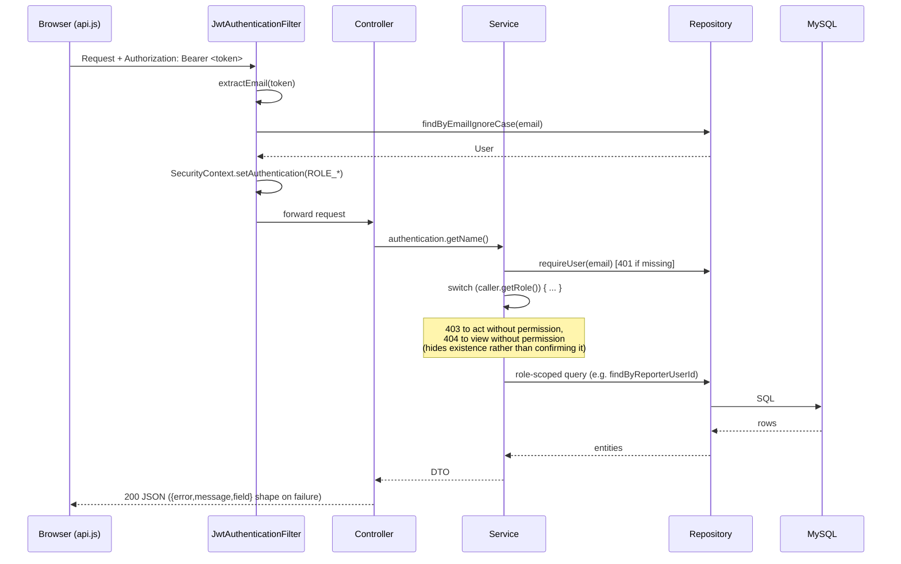
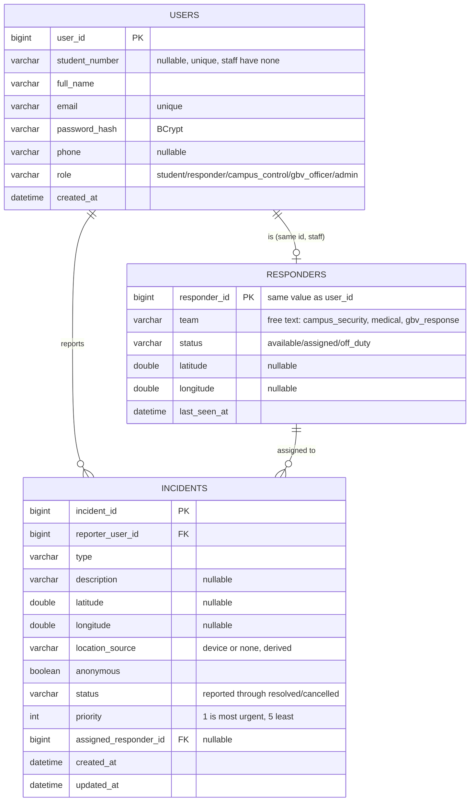
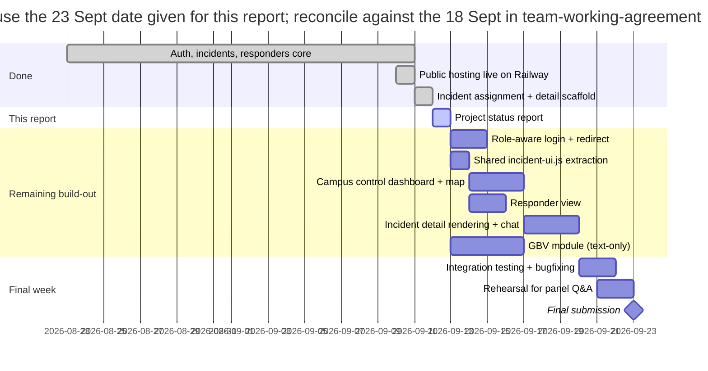

# UFH Safety Platform: Project Status Report

**Prepared:** 2026-09-12
**Repository:** [Mjubane5/ufh-safety-platform](https://github.com/Mjubane5/ufh-safety-platform)
**Live deployment:** https://ufh-safety-platform-production.up.railway.app

---

## AI assistance disclosure

This section  discloses the use of AI, and for the parts of the project an AI assistant
was actually involved in.

**Tool used.** Claude Code (Anthropic), running the Claude Sonnet 5 model,
used interactively by assigned developers in a chat session.

**What it did**, scoped to what's actually verifiable from that session's
own history rather than a general claim:

- Deployed the application to Railway: provisioned the MySQL database,
  configured the environment variables, generated the production
  `JWT_SECRET`, and set up the live domain. This is infrastructure and
  configuration work, not application code.
- Rewrote `DEPLOYMENT.md` and `AGENT-DEPLOYMENT-INSTRUCTIONS.md` (PR #22)
  once they'd gone stale against the architecture actually deployed.
- Compiled this status report (PRs #27, #28, #29): ran the git, GitHub,
  and test-suite commands that produced the real numbers throughout it,
  drafted the prose, and corrected several parts of it based on direct
  review and follow-up questions.
- Added the cross-pair contribution note and the record of Sinesipho
  Malgas's repository status to `docs/team-working agreement_1.md`.
- Drafted, but has not yet built, an implementation design for a campus
  control dashboard, a responder view, a GBV reporting module, and an
  incident chat feature. None of that is in the codebase yet.

**What it explicitly did not do**, as far as this session can verify: no
commit touching `backend/src/main/java` or `frontend/` anywhere in this
repository's history was authored with this assistant's involvement. Every
incident, responder, and auth feature described in section 6 above was
written by team members directly, as the contribution matrix in section
13 shows.

**A limit worth stating plainly.** This disclosure can only account for
what one assistant, in the sessions it was actually part of, has visibility
into. If AI tools were used elsewhere in the project's history in ways this
session has no record of, that use needs disclosing by whoever did it,
for the same reason this note exists: a disclosure is only useful if it's
complete, not just the part that was easy to write down.

**On commit attribution specifically.** This repository has a standing
rule against adding an AI assistant as a co-author on commits or pull
requests. That predates this disclosure and stays in place. Disclosure
lives here, in the written report, matching the department's specific
guidance, rather than scattered across commit metadata that most readers
of this report will never open.

---

## 1. Problem statement, audience, and objectives

**The problem.** Students at Fort Hare have no single, fast way to report a
safety incident, reach campus control, or find wellness support when
something goes wrong. What exists today is spread across phone numbers,
offices and word of mouth, which is slow exactly when speed matters most.
Gender-based violence cases need an even more careful path: confidential,
and handled by people trained for it, not whoever happens to pick up first.

**Who it's for.** Students filing reports, campus control staff triaging
and dispatching them, on-campus responders (security and medical) acting on
them, and GBV officers handling confidential cases separately. Four roles,
one system, very different access to the same underlying data.

**What it's trying to do**, per `CLAUDE.md` and `docs/api-contract.md`:

- Let a student file a report, including a one-tap SOS, in under a minute,
  whether or not they can share their location.
- Route it to the right person. Campus control for general incidents, a GBV
  officer for confidential ones, and never the wrong role.
- Track it through a proper lifecycle (`reported` through `triaged`,
  `assigned`, `en_route`, `on_scene`, `resolved`, or `cancelled` for a false
  alarm) instead of treating a report as a one-way message into a void.
- Stay honest about being a prototype. Synthetic data only, and it needs to
  be unmissable that no report here reaches a real emergency service, so it
  can be demonstrated publicly without the risk of someone in genuine
  distress trusting it.

This is a CSC 200/CSC 300 capstone at the University of Fort Hare, a team of
eight split roughly four and four across frontend and backend, and part of
the grading is being able to explain your own design decisions out loud to
a panel.

---

## 2. Scope changes, feature additions, and de-scoping

Pulled from the decision log in `docs/team-working agreement_1.md`, plus
what got decided in the two most recent sessions: the Railway deployment
and the scoping conversation for this report.

| Date | Change | Why |
|---|---|---|
| pre-2026-09-10 | Real-time updates use 5-second polling, not WebSockets | Decision log. No new dependency, and it matches CLAUDE.md's rule about flagging new libraries |
| pre-2026-09-10 | Maps run on Leaflet + OpenStreetMap, not Google Maps | No API key, no billing, per the decision log |
| pre-2026-09-10 | Evidence is stored as a filepath in MySQL, not a BLOB | Decision log |
| 2026-09-10 | Frontend bundled into the backend jar. One Docker service instead of three | `feature/host-single-service`, PR #19. Same origin means no CORS to configure in production, and one push updates both halves at once |
| 2026-09-10 | A demonstration interstitial is now required before public hosting | `feature/demo-notice`, PR #18, and `docs/deployment.md` §5.1. A safety prototype that looks real is a genuine hazard if the wrong person finds it |
| 2026-09-11 | Hosting target is Railway, not Render | `docs/hosting-railway.md`. Render's free tier only offers Postgres, not MySQL, and it sleeps after 15 minutes idle. Railway runs the Dockerfile as-is with managed MySQL |
| 2026-09-11 | Deployment docs rewritten | `DEPLOYMENT.md` and `AGENT-DEPLOYMENT-INSTRUCTIONS.md` still described the old three-service setup after the Dockerfile changed. Fixed in PR #22 |
| 2026-09-12 (planned) | GBV module scoped to text-only reports plus the officer queue for now. Evidence upload deferred | Multipart upload with EXIF stripping is its own chunk of security work. Cutting it keeps the rest of the GBV flow, which the working agreement says carries a significant part of the Security mark, achievable in the time left |
| 2026-09-12 (planned) | Incident chat limited to non-anonymous reports | GBV reports are anonymous by design: a reference code instead of an account, and `contactPreference` has to be `none` when `anonymous` is true. A generic chat feature would break that unless the contract changes first, and that needs the team's sign-off, not a workaround nobody agreed to |
| 2026-09-12 | Working agreement amended to formally allow cross-pair contribution | The pairing in `docs/team-working agreement_1.md` §1 was written as fixed lanes, but §13 below shows real work crossing those lines more than once. Rather than treat that as a violation of the plan, the agreement now says explicitly that pairs describe primary ownership, not a hard boundary, which is normal on real software teams. The existing rule to post in the group chat before touching another pair's files still stands |

One more thing worth writing down, not really a decision but a fact that
affects scope: Railway gives a new account a one-off $5 trial credit that
lasts 30 days from when the project was created (2026-09-11). It doesn't
run free forever. Once the trial runs out, keeping the demo live costs
$5/month on the Hobby plan. Someone needs to own that cost, or the fallback
plan should be a recorded demo once the trial lapses (see
`docs/hosting-railway.md`).

---

## 3. System architecture

### 3.1 Client-server data flow


One origin, one deployable, and nothing cross-origin in production. The
pages and the API ship inside the same jar because the Dockerfile copies
`frontend/` into `src/main/resources/static` at build time.

### 3.2 Request lifecycle, or how a role actually gets enforced



There's no `@PreAuthorize` and no centralized route-based role gate.
`SecurityConfig` only decides whether you're authenticated at all. Every
actual role decision is a plain `switch` statement sitting inside a service
class, right next to the query it's guarding. Anything new (GBV, chat)
should follow this same pattern rather than bring in a second way of doing
authorization.

### 3.3 Data model, as built, plus what's still on paper



`GbvReport`, keyed by a reference code rather than a user id, and
`IncidentMessage` are both fully specified in `docs/api-contract.md` §7 and
planned for the next build phase, but neither exists in code yet, so
they're left out of the diagram above instead of drawn as if they were
already built.

---

## 4. Technology stack and why each pivot happened

| Layer | Choice | Reasoning and the trade-off that came with it |
|---|---|---|
| Frontend | Plain HTML, CSS, JS, no framework | Required by `CLAUDE.md` so every line stays explainable to a panel without a build step to reason about first |
| Backend | Java 17, Spring Boot 3.4.5 | Fits the team's existing coursework, and Spring Security plus Spring Data JPA cover auth and persistence without either being hand-rolled |
| Auth | JWT via `jjwt` 0.12.6, BCrypt | Stateless, so no session store to run. Fixed 120-minute expiry with no refresh token, an accepted shortcut for a prototype that's worth revisiting if a demo runs long |
| Database | MySQL 8 | What the team already knows, and Railway offers it as a managed service. Render's free tier is Postgres-only, see §2 |
| Maps | Leaflet + OpenStreetMap | No API key and no billing risk for a student project |
| Hosting | Railway, one Docker service | Pivoted away from an earlier three-service draft once the Dockerfile started bundling frontend into the jar. Fewer moving parts, no CORS, one thing to redeploy |
| Algorithms | C++, standalone | Deliberately kept out of the request path per the contract. It's a demonstration of the algorithm, not something the running app depends on |
| Analysis | Python, offline | Results get seeded into MySQL ahead of time rather than computed on request |

---

## 5. Repository and branch status

- **Repository:** https://github.com/Mjubane5/ufh-safety-platform (private)
- **Default branch:** `main`
- **Live URL:** https://ufh-safety-platform-production.up.railway.app,
  Railway project `dazzling-insight`, redeploys automatically on every merge
  to `main`.
- No release tags exist yet. Worth tagging a checkpoint, something like
  `v0.1-progress`, once this report and the next build phase land, so
  "what got submitted" has a fixed point to point at instead of "whatever
  `main` happened to be that day."
- 26 pull requests merged so far (see §13 for who they belong to), none
  open, and only one closed without merging (#12, which never had any
  content). Nothing currently blocked on branch protection.

---

## 6. Feature inventory: done versus pending

Checked line by line against every endpoint and page named in
`docs/api-contract.md`.

| Area | Status | Detail |
|---|---|---|
| Auth: register, login, me | Done | `auth` package plus `login.html`/`register.html` |
| Incident report, list, detail, status, cancel | Done | `incidents` package, role-scoped per §3.2 for student/responder/campus_control/admin |
| Incident assignment, auto-nearest or explicit | Done | `IncidentAssignmentService`, merged in PR #26 on 2026-09-12. A responder is also now correctly freed back to `available` once the incident resolves or is cancelled |
| Responder availability list | Done | `GET /api/responders/available`, `responders` package |
| Student dashboard | Done | `dashboard.html`, with filters, pagination, and skeleton/empty/error states |
| Incident report form | Done | `report.html`, with geolocation capture and a graceful fallback |
| Incident detail page | Scaffolded, not rendered | `incident.html`/`incident.js` (PR #25) parse the query string and encode the display rules already, but the actual rendering isn't written |
| Patrols (`POST`/`GET /api/patrols`) | Not started | No `patrols` package exists |
| Safety map, hotspots, safe routes | Not started | No `hotspots` or `routes` package, and no map-rendering code anywhere in the frontend despite Leaflet being the agreed provider |
| Wellness resources and bookings | Not started | No `wellness` package exists |
| GBV reporting, all of contract §7 | Not started | No `gbv` package on the backend and no GBV page on the frontend. Fully specified, nothing built |
| Campus control dashboard | Not started | There's no role-aware redirect at all right now. Every login lands on `dashboard.html` regardless of role |
| Responder view | Not started | Same gap as above |
| GBV officer dashboard | Not started | Same gap again |
| Incident chat | Not started | Not even in the contract yet, see §2 |

---

## 7. Screenshots, API payloads, and wireframes

Captured this session against a local copy of `frontend/` running in its
own `MOCK` mode (`python -m http.server 5500`, no backend needed, which is
the documented way to run it without live data), and checked against the
live Railway URL too. Binary image files aren't embedded in this Markdown
version. What's below should be enough to stand in until real screenshots
land in a `docs/screenshots/` folder, or in a Word version of this report
if one gets produced.

- **Login (`/login.html`).** On first load an interstitial dialog blocks
  the page: "This is a demonstration, not a real safety service," with SAPS
  10111, ambulance/fire 10177, the GBV Command Centre 0800 428 428, and
  Childline 116 listed, and it needs an explicit "I understand this is a
  demonstration" click before it goes away. A red banner with the same
  message stays pinned above the form after that. Confirms that
  `docs/deployment.md` §5.1 is actually built, not just written down.
- **Dashboard (`/dashboard.html`, mock data).** "Your reports, A" as the
  heading, a "Report an incident" button, status filter chips running from
  All through Cancelled, and incident cards like "Medical emergency,
  Reference 42" and "SOS, Reference 41," the second one with a red
  emergency accent bar.
- **Report form (`/report.html`).** An incident-type dropdown, a
  1000-character description field with a live counter, and, captured
  live rather than staged, the actual permission-denied fallback: "Location
  permission was blocked. The browser will not ask again... You can send
  your report without it."
- **Incident detail (`/incident.html?id=42`).** Confirms the PR #25
  scaffold exactly as described in its own commit message: the header, the
  demo banner, and a "back to your reports" link all render, but the
  content area is empty because rendering hasn't been written yet.

Real API payload, captured against the live deployment:

```
$ curl -X POST https://ufh-safety-platform-production.up.railway.app/api/auth/register \
    -H "Content-Type: application/json" -d '{}'

{"error":"VALIDATION_FAILED","message":"Email is required.","field":"email"}
```

Wireframes for the four pages/panels that don't exist yet (campus control
dashboard, responder view, GBV officer dashboard, incident chat) weren't
drawn up separately in this pass. They're designed instead as reused
layouts in the next build phase (the `.layout-split` list-plus-map
structure and the existing card/pill/skeleton components already in the
CSS), rather than fresh mockups. Happy to sketch these out as actual
wireframe images ahead of building them if that would help.

---

## 8. Test coverage

```
$ ./mvnw test
```

| Package | Test class | Tests | Failures |
|---|---|---|---|
| `auth` | `AuthServiceTest` | 5 | 0 |
| `auth` | `JwtServiceTest` | 3 | 0 |
| `common` | `GlobalExceptionHandlerTest` | 3 | 0 |
| `incidents` | `IncidentAssignmentServiceTest` | 9 | 0 |
| `incidents` | `IncidentEnumTest` | 6 | 0 |
| `incidents` | `IncidentLifecycleTest` | 14 | 0 |
| `incidents` | `IncidentServiceTest` | 11 | 0 |
| `incidents` | `PriorityCalculatorTest` | 3 | 0 |
| `incidents` | `StatusTransitionsTest` | 5 | 0 |
| `responders` | `NearestResponderSelectorTest` | 6 | 0 |
| `responders` | `ResponderServiceTest` | 5 | 0 |
| **Total** | **11 classes** | **70** | **0** |

All of it is plain JUnit5, Mockito and AssertJ against mocked repositories.
No database in the loop, which `backend/pom.xml` confirms since it has no
test-DB dependency at all, no H2 and no Testcontainers. That's a deliberate
trade-off documented in `docs/deployment.md` §5.7: fast and fully isolated,
but a genuinely bad query would still sail through the suite. There are
zero `@Disabled` tests left. The assignment feature's tests were written
disabled up front and enabled one at a time as the feature got built out
(PR #26).

No coverage percentage is reported here because `backend/pom.xml` doesn't
have a coverage plugin at all, jacoco or otherwise. Recommending one now,
flagged per CLAUDE.md's rule about not adding libraries quietly: adding
`jacoco-maven-plugin` is a build-time-only addition, not a runtime
dependency, and it's the standard tool for exactly this. A later version
of this report could then state a real percentage instead of just a test
count.

---

## 9. Performance benchmarks

There's no load-testing tool set up, no JMeter, k6 or Gatling anywhere in
the project, and memory or throughput profiling wasn't attempted this
session. Better to say that plainly than fill the section with made-up
numbers. What was actually measured: simple wall-clock timing of single
requests against the live Railway deployment, from one machine, one
location, one point in time. A sanity check, not a benchmark suite.

| Endpoint | Status | Time (single sample) |
|---|---|---|
| `GET /` | 200 | 0.99s cold, then 0.59s, 0.51s |
| `GET /login.html` | 200 | 0.43s |
| `GET /api/incidents`, no token | 401 | 0.48s |
| `POST /api/auth/register`, invalid body | 400 | 0.74s |
| `GET /api/responders/available`, no token | 401 | 0.50s |

Everything landed well under a second with no artificial load applied. If
real benchmarks are needed for the submission, that's separate follow-up
work, a small k6 or JMeter script run against a few key endpoints under
actual concurrent load, rather than something to bolt onto this report.

---

## 10. Bug, vulnerability, and edge-case log

| Item | Status | Source |
|---|---|---|
| No rate limiting on `POST /api/auth/login` | Open | `docs/deployment.md` §5.4 calls this the one item on the list that's genuinely still open. Nothing currently slows down someone guessing passwords |
| No rate limiting on the GBV reference-code status lookup | Open, module not built | Required by the contract (`docs/api-contract.md` §7) once GBV ships |
| `spring.jpa.hibernate.ddl-auto=update` in production | Accepted limitation | Adds columns but never narrows or removes them. Real migrations via Flyway or Liquibase would need a team decision first, see `docs/deployment.md` §5.3 |
| No automated integration tests, service layer only against a mocked database | Accepted limitation | `docs/deployment.md` §5.7. A bad query currently passes the suite regardless |
| Spring Security's default generated-password warning at boot | Benign but worth understanding | `UserDetailsServiceAutoConfiguration` kicks in because no `UserDetailsService` bean is registered, since the app uses its own JWT auth instead. Harmless as long as nothing routes through Spring's default form login, but a panel could reasonably ask about it |
| Failing or disabled tests | None | 70 out of 70 passing, zero `@Disabled`, see §8 |
| Tracked GitHub issues | None open | `gh issue list` comes back empty. The team is tracking known gaps in `docs/development-challenges.md` §6 and `docs/deployment.md` §5 instead of using GitHub Issues |

---

## 11. Challenges and mitigations

`docs/development-challenges.md` already covers this territory in detail
through 2026-09-10: environment and tooling problems, database issues,
API-behavior bugs, frontend integration, and process mistakes (enum
wire-value mismatches, the page-numbering-starts-at-1-vs-0 bug a test
actually caught, a pull request that said "Merged" but never reached
`main`, and several more). None of that gets repeated here. What follows is
what came up after that document's scope, during deployment and planning
work since then.

**A campus or lab network blocking outbound connections to non-standard
ports.** Setting up Railway's MySQL started with an attempted SSH tunnel,
then a temporary public TCP proxy, just to run a one-time schema-creation
script. Both timed out, and `Test-NetConnection` confirmed the network
blocks that kind of outbound traffic outright. The fix was to stop trying
to connect from outside at all: MySQL's `createDatabaseIfNotExist=true`
JDBC option lets the app create its own schema over Railway's private
network the first time it boots, so no external connection to the database
was ever needed. The temporary public proxy was removed again right away.

**Deployment docs going stale within a day of being written.**
`DEPLOYMENT.md` and `AGENT-DEPLOYMENT-INSTRUCTIONS.md` still described a
three-service setup and a manual edit to `frontend/js/config.js`, both of
which stopped being true the moment the Dockerfile started bundling the
frontend into the jar. They were rewritten in PR #22 to match what
actually gets deployed, using the real commands that were run to do it.

**A request to add chat everywhere running straight into the GBV anonymity
model.** GBV reports are anonymous by design: no account, a reference code
instead of an id, and `contactPreference` has to be `none` whenever
`anonymous` is true, specifically so a reporter can't be traced. Rather
than build a chat feature that would need to punch a hole in that on the
quiet, chat was scoped down to non-anonymous incident flows only for now.
Touching GBV reports with chat needs a contract change the whole team signs
off on, not something decided alone mid-build.

---

## 12. Timeline: remaining work toward submission

Built from the known milestones in `docs/team-working agreement_1.md` plus
a day-by-day breakdown of what's left in the next build phase. Owner
columns are left blank on purpose. That's a call for the team to make, not
something to guess at from git history (§13 explains why guessing would be
actively misleading here).



As a checklist of weekly deliverables rather than names attached to tasks:

- This week, roughly by 2026-09-14: role-aware routing, the shared UI
  module, and the responder view. These are the smallest and least risky
  pieces, and everything else depends on them.
- Next, by around 2026-09-18: the campus control dashboard with its map,
  the text-only GBV module, and the incident detail rendering.
- Final days: the chat feature, an integration pass, and rehearsal.

---

## 13. Individual contributions, checked against the working agreement

`docs/team-working agreement_1.md` names eight people across four pairs.
This section lines that roster up against what's actually visible in git
and GitHub: `git shortlog` and `gh pr list --state merged` for authorship
on the surface, `Co-Authored-By` trailers in commit messages underneath
that because this repo actually uses them for pairing, and, underneath
that again, GitHub's own commit-to-account linking, which matches a
commit's email address to a registered GitHub account even when that
account's real name never appears anywhere in the git history itself. That
third layer is how Scott's commits got found. His git author name reads as
"Mjubane5" and his email resolves through GitHub to the account
`Ace-Mabheka`, so a plain-text search for "Scott" in the repository was
never going to turn him up. A couple of the matches below are still
educated guesses based on what the commits touch, clearly marked as such,
and none of this is a ranking of who worked hardest. Review and planning
done together at one screen leaves no trace in any of this, which matters
for reading the table honestly.

Commit counts here come from GitHub's own contributor statistics, which
count against the deduplicated `main` branch rather than every branch that
ever existed, so they read a bit lower than a raw `git shortlog --all`
would.

| Roster member | Pair and assigned area | GitHub account | Commits | Merged PRs | Notes |
|---|---|---|---|---|---|
| Mpilwenhle Jubane | D, incident report form and student dashboard | `Mjubane5` | 36 | 23 | Work goes far past Pair D's assigned area: auth, incident endpoints, responders, deployment, most of the documentation. This looks like the bulk of the whole repository |
| Scott | C, page layout, shared CSS, api.js, login/register | `Ace-Mabheka` | 4, plus one more as a co-author | 0 of his own (his work landed inside pull requests opened and merged under `Mjubane5`) | Committed under the display name "Mjubane5" with a personal email, and a co-author trailer on one commit even spells his name as "Andile Ntombela." GitHub's account linking is what actually ties all of that back to him. His commits are "Add student dashboard," "Fix report form loading state, error labelling and auth guard," "Harden auth security defaults and add auth tests," and a co-authored "Add incident report form," all of it Pair D's territory rather than his own Pair C |
| Nkosinathi Mbewana | B, incident endpoints and status lifecycle | `Nkosinathi-Mbewana` | 2 (1 as author, 1 as co-author) | 1 | The one PR under his own name is "Add authentication backend with MySQL and JWT," Pair A's area, not Pair B's. His co-authored commit ("Harden auth security defaults and add auth tests") is auth work too |
| Brains Nkosi, unconfirmed | B, incident endpoints and status lifecycle | `SiyabongaNkosi23`, surname matches, first name doesn't | 2 | 2 | "Create seed.sql" and "Add Incident entity with attributes and methods," both close to Pair B's territory, which supports the guess without confirming it |
| Nondumiso Mbuli | A, database schema and auth endpoints | `nondumisombuli16` | 1, as a co-author | 0 | "Implement nearest responder selection" is backend algorithm work, closer to Pair B's territory than Pair A's own schema and auth |
| Nondumiso Mkhonto, fairly likely | C, page layout, shared CSS, api.js, login/register | probably `Nondum1s0`, inferred by matching the remaining unaccounted commit to the remaining unaccounted collaborator, not independently confirmed the way Scott's identity now is | 1, as a co-author | 0 | "Add mobile-first base stylesheet" matches Pair C's assigned area exactly, which is the main reason this guess feels solid |
| Awethu Dyani | D, incident report form and student dashboard | `awethudyani51-hash` | 1, as a co-author | 0 | "Add login and register pages" is Pair C's assigned area, not his own Pair D |
| Sinesipho Malgas | A, database schema and auth endpoints | not a collaborator on this repository | 0 | 0 | Confirmed directly against the GitHub collaborator list, not just a text search this time. No account was ever added to the repository at all, so there's no commit, PR, review, or comment to find under any name or handle. Whatever she contributed happened entirely outside version control |

A few things worth saying plainly instead of leaving them buried in the
table:

- Seven of the eight roster names have some real footprint in the
  repository once every layer above is counted, a big change from the
  first pass at this table, which only found three. Sinesipho Malgas is
  the one confirmed exception, and it's a different kind of gap from the
  others: not a missed search, but an absence from the repository itself.
- The repository actually has fifteen collaborators added, not eight.
  Beyond the ones matched above, `SIBONGAKONKE651`, `XhantiMakeleni26`,
  `Gobongowandile`, `Ibongwe05`, `Nombulelo24`, `AsehGatsheni0920`,
  `SisonkeN14`, and `somilamathinjwa6-sudo` are all collaborators with zero
  commits under their own accounts.
- `docs/team-working agreement_1.md` has been updated (2026-09-12) to say
  outright that pairs describe primary ownership, not a hard boundary,
  since the table above shows contributions crossing pair lines more than
  once. Letting people help wherever the work needs doing is standard
  practice on real software teams, and writing that down means the
  overlap found here reads as expected, not as a rule being broken.
- Pair C's own assigned area (`frontend/js/api.js`, `frontend/css/styles.css`,
  login and register pages) has real commits behind it, but from Scott and
  Nondumiso Mkhonto working inside Pair D's and their own area
  respectively, and from Awethu Dyani (Pair D) working inside Pair C's. The
  pairing on paper and the pairing in practice don't fully match, which is
  worth the team confirming out loud before a panel asks someone to explain
  code they weren't recorded as having touched.
- One PR ("Add authentication backend with MySQL and JWT," #8) is credited
  to a Pair B member for work the agreement assigns to Pair A. Could easily
  be someone helping out where needed, which is normal, but it's still a
  real mismatch between the plan on paper and what the history shows.
- Even with every layer counted, one person's account still accounts for
  the large majority of commits and every single merged pull request.
  That's the conversation worth having among the eight of you, not
  something a table like this can settle by itself.

---

## Sources

Every number and claim above traces back to something that was actually
run or read this session: `git log`, `git shortlog`, and `gh pr list`
against the live repository (2026-09-12), `./mvnw test` output, `curl`
against the live deployment, and direct reading of `CLAUDE.md`,
`docs/api-contract.md`, `docs/team-working agreement_1.md`,
`docs/development-challenges.md`, `docs/deployment.md`,
`docs/hosting-railway.md`, and the current `backend/src/main/java` and
`frontend/` source trees.
